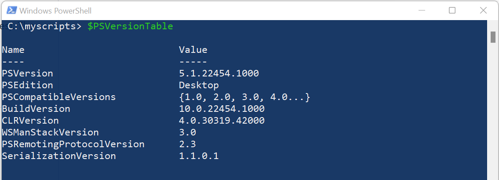
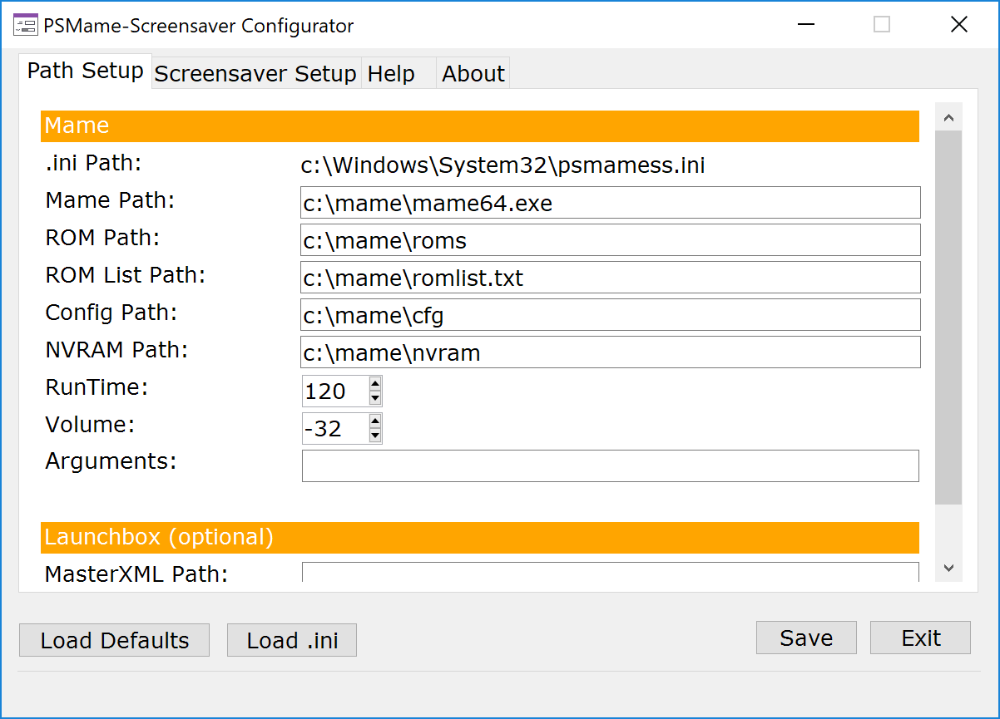
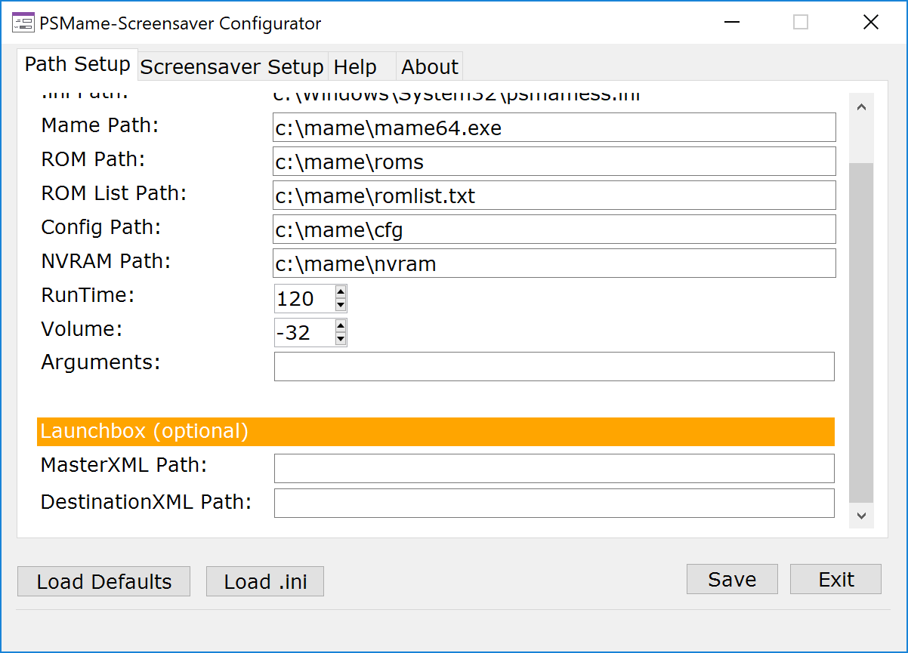
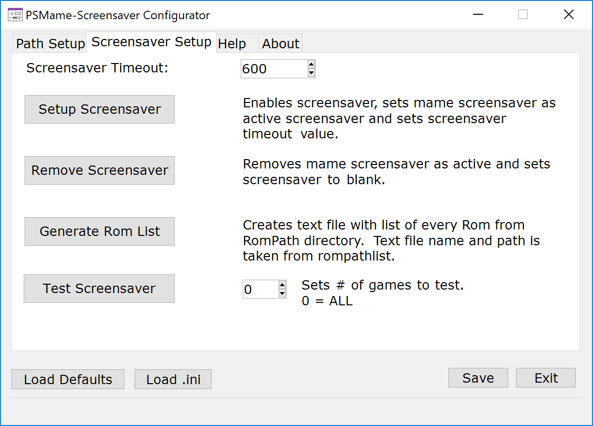

# PSMame-Screensaver
A Windows screensaver using MAME to run arcade games in an attract mode fashion.  Game is selected at random, mame executes the game and plays it for a set runtime.  Once the runtime is reached, mame exits and repeat!  

Support for the front end Launchbox was recently added.  Add the running game to a launchbox list by pressing a key (or button).  Great for tagging games you see running in the screensaver for play at a later time.
  
PSMame-Screensaver is written in Powershell and then compiled to an .exe (.scr) with a powershell wrapper.  It was written to run on my home MAME cabinet. I wrote the first version in 2015 and wanted to share.  It's been cleaned up, a configuration program added and the entire project posted here on github.

Why use Powershell?  Why not! It's straight forward and easy to understand.

## Prerequisites
* Operating System - Windows 10, 8, or 7 should work fine as long as prereq's are installed.
  * Windows 10 meets all prerequisites out of the box.
* .NET Framework 4.5.2 (or higher) - https://www.microsoft.com/en-us/download/details.aspx?id=42643  
* Powershell 5.0/5.1 - https://www.microsoft.com/en-us/download/details.aspx?id=54616 
  * This is part of Windows Management Framework.  Be sure to install .NET first.
  * To check your version of powershell, launch Windows Powershell and type: "$psversiontable" (no quotes).  The very first entry in the list should tell you the PSVersion.  This should be 5.x
   
* MAME - https://www.mamedev.org/  

## Installation & Setup
* Download the psmamess.zip file with the binaries inside.  
Get latest release from https://github.com/kaband/PSMame-Screensaver/releases
  * psmamess.scr - Screensaver file  
  * psmamesscfg.exe - Configuration utility for screensaver  
  * psmamess.ini - Configuration itself
* Extract zip to directory of your choosing
* Copy psmamess.scr and psmamess.ini to the c:\windows\system32 directory
* Run the psmamesscfg.exe file to launch the configuration utility - this will put your configuration settings into the .ini file
  * Should be launched as administrator in order to edit psmamess.ini file in the c:\windows\system32 directory
  * Configurator will now prompt for administrator elevation
* Define your paths in path setup tab and click save button. See **Path Setup tab (Mame)** and **Path Setup tab (Launchbox)** sections below for details.
* Once the paths are set. Select Screensaver tab.
* Set Screensaver Timeout value and click [Setup Screensaver] button to add the screensaver to the OS and set it as default. See **Screensaver Tab** section below for details.
* Done.

## Manual Configuration
There is no reason that you have to use the psmamesscfg.exe program in order to configure the screensaver.  The paths within the .ini file can be easily edited with notepad and the screensaver settings can be set within the Operating System itself.  The psmamecfgss.exe is there to make it a bit easier.

## Path Setup Tab (Mame)
  
  

 * Mame Path* - Path to mame executable.  Should include executable name.  ex. c:\mame\mame64.exe  
 * Rom Path* - Path to directory that contains rom files used by Mame.  ex. c:\mame\roms
 * Rom List Path* - Path to file that contains a list of rom names.  Should include file name. ex. c:\mame\romlist.txt  
   * PSMame-Screensaver Configurator includes a button to generate the list.  The list consists of the files from the roms directory with the extension removed (ex. thisgame.zip becomes thisgame).  If you are using a merged set, it will only capture the primary game.
   * I recommend using Romlister instead to generate your list of roms.  Export from romlister in txt format with only the name of the rom included. Use that file as your rom path list source.  https://www.waste.org/~winkles/ROMLister/
 * Config Path - Location of the MAME config files. ex. c:\mame\cfg
 * NVRAM Path - Location of the MAME NVRAM files. ex. c:\mame\nvram
 * Run Time - Amount of time in seconds to run game.
 * Volume - Volume of running game.
 * Arguments - Any additional arguments you want to pass to mame executable.
 * Save button - Click this button once your configuration is set to save your settings.
 * Load Defaults button - Resets all settings to default, but will not take effect until it is saved. 
 * Load ini button - Will reload settings from .ini file
 
 \* = required

## Path Setup Tab (Launchbox)
  

The master playlist and destination playlist fields are for those who run mame via launchbox https://www.launchbox-app.com/. I use launchbox as the frontend for my mame cabinet and couldn't be happier. I've gone through a number of frontends since the very first iteration of my mame cabinet in late 1999/early 2000 and launchbox is by far the best one. It's well worth a lifetime license.  

I keep my mame cabinet running most of the time. I pass by it often in its location and enjoy seeing what game is currently playing.  Many times I see a new game to try and I wanted a quick, easy way to tag a game for play at a later time.  Here's how it works:  
 
When a Mame game is running, you can take a screenshot at any time with the screenshot key.  When the game reaches the end of its runtime, the screensaver will look for any screenshots taken during the run of the game. If one was taken, it will get the game info from the master playlist xml file and add the game to the destination playlist.  In the screenshot above, there is a master playlist called arcade.xml which contains all the mame games in a collection and a destination playlist called TryMe.xml that will have any games that had a screenshot taken during its runtime.

## Screensaver Tab  
  
    
  
 * **Screensaver timeout** - Amount of idle time in seconds before screensaver starts.
 * **[Setup Screensaver] Button** - Click this button once you are ready to enable the psmame screensaver as the default.
   * Enables screensaver, sets psmame screensaver as active screensaver and sets screensaver timeout value.
 * **[Remove Screensaver] Button** - Removes mame screensaver as default and sets blank screen as new default.
 * **[Generate Rom List] Button** - Creates txt file list of rom names.  List is based of off rom path and saved to the rom list path directory.
 * **[Test Screensaver] Button** - You can test the screensaver and limit the amount of games it rotates through for the test only.

## Usage
 * When the screensaver is running, MAME functions normally.  You can play the game that is running, but once the runtime value is reached it will exit the game.
 * In order to exit the screensaver use the key mapped to exit mame.  The escape key is the default key mapped to exit.  
   
## Compiling
Compiling is optional.  There are compiled versions of the screensaver and the configurator software in the releases section.  However, if you want to customize the script or just do the compiles yourself then it's easily done.  
I use Sapien's Powershell Studio to write the powershell scripts, create the forms used in the psmamesscfg.exe and to compile it all to exe's.  It's great software if you write a lot of powershell scripts and I highly recommend it, but it's not inexpensive.  You can compile the screensaver script to an exe yourself w/o purchasing any software using PS2EXE.
  
 * Get it here: https://github.com/MScholtes/TechNet-Gallery/tree/master/PS2EXE-GUI
 * You can use the following to compile: ps2exe.ps1 -inputFile .\psmamess.ps1 -outputFile .\psmamess.scr -runtime40 -x64 -Sta -verbose
