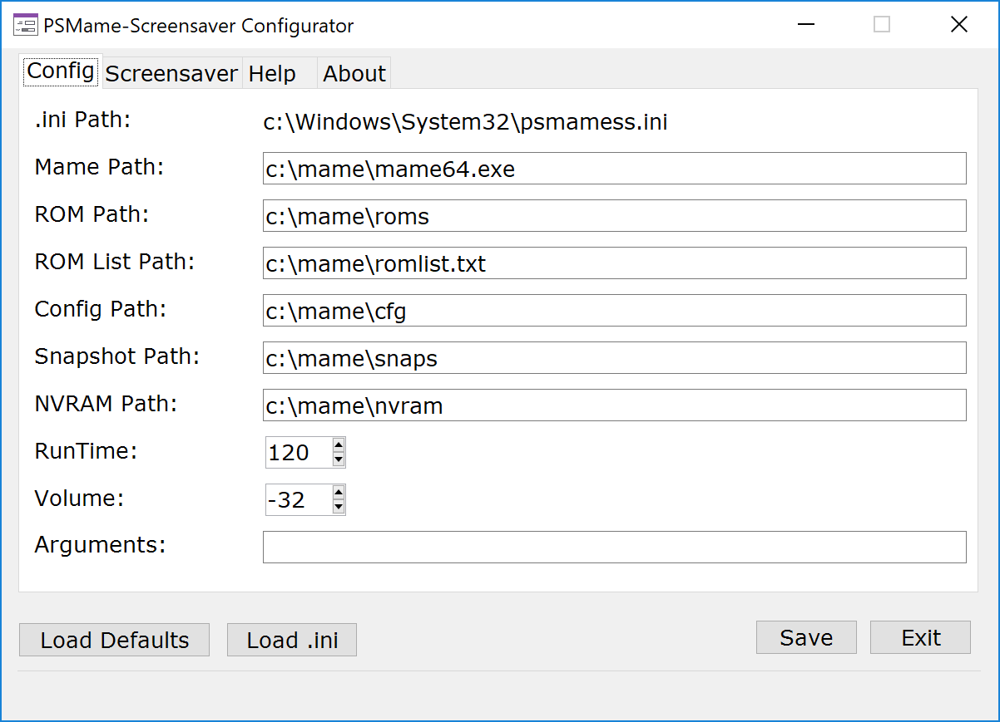

# PSMame-Screensaver
This is a screensaver which uses MAME to run arcade games in an attract mode fashion.  A game is selected at random, mame executes the game and plays it for a set runtime.  Once the runtime is reached, mame exits and repeat!  
  
PSMame-Screensaver is written in Powershell and then compiled to an .exe (.scr) with a powershell wrapper.  It was written to run on my home MAME cabinet. I initially wrote it 3 years ago and wanted to share.   I cleaned it up, created a configuration program addon and posted it to github.  

Why use Powershell?  Why not! I wanted something straight forward and easy to understand.  Powershell fit the bill.

**Prerequisites**  
* .NET Framework 4.5.2 (or higher) - https://www.microsoft.com/en-us/download/details.aspx?id=42643  
* Powershell 5.0/5.1 - https://www.microsoft.com/en-us/download/details.aspx?id=54616 
  * This is part of Windows Management Framework.  Be sure to install .NET first.
  * To check your version of powershell, launch Windows Powershell and type: "$psversiontable" (no quotes).  The very first entry in the list should tell you the PSVersion.  This should be 5.x
* MAME - https://www.mamedev.org/  
* Windows OS - Windows 10, 8, or 7 should work fine as long as .NET 4.5.2 and Powershell 5.0/5.1 from Windows Management Framework is installed.  
  * Windows 10 meets these requirements out of the box.

**Installation**
* Download the psmamess.zip file with the binaries inside.  
Get latest release from https://github.com/kaband/PSMame-Screensaver/releases
  * psmamess.scr - Screensaver file  
  * psmamesscfg.exe - Configuration utility for screensaver  
  * psmamess.ini - Configuration itself
* Extract zip to directory of your choosing
* Copy psmamess.scr and psmamess.ini to the c:\windows\system32 directory
* Run the psmamesscfg.exe file to launch the configuration utility - this will put your configuration settings into the .ini file
  * Should be launched as administrator in order to edit psmamess.ini file in the c:\windows\system32 directory
* Once configuration is set. Select Screensaver tab.
* Set Screensaver Timeout value and click [Setup Screensaver] button
* Done.
* See Configuration tab and Screensaver tab for details.

 **Manual Configuration**  
There is no reason that you have to use the psmamesscfg.exe program in order to configure the screensaver.  The paths within the .ini file can be easily edited with notepad and the screensaver settings can be set within the Operating System itself.  The psmamecfgss.exe is there to make it a bit easier.

**Usage**
 * When the screensaver is running, MAME functions normally.  You can play the game that is running, but once the runtime value is reached it will exit the rom.
 * In order to exit the screensaver use the key mapped to exit mame.  Escape key is the default mapping to exit mame.  
   
**Configuration Tab**  
  
  

 * Mame Path* - Path to mame executable.  Should include executable name.  ex. c:\mame\mame64.exe  
 * Rom Path* - Path to directory that contains rom files used by Mame.  ex. c:\mame\roms
 * RomPath List* - Path to file that contains a list of rom names.  Should include file name. ex. c:\mame\romlist.txt  
   * mamesscfg.exe includes a button to generate the list.  The list consists of the files from the roms directory with the extension removed (ex. thisgame.zip becomes thisgame).  If you are using a merged set, it will only capture the primary game.
   * I recommend using Romlister instead to generate your list of roms.  Export from romlister in txt format with only the name of the rom included. Use that file as your romlist source.  https://www.waste.org/~winkles/ROMLister/
 * Config Path - Location of the MAME config files. ex. c:\mame\cfg
 * Snapshot Path - Location of the MAME snapshots. ex. c:\mame\snapshots
 * NVRAM Path - Location of the MAME NVRAM files. ex. c:\mame\nvram
 * Run Time - Amount of time in seconds to run ROM.
 * Volume - Volume of running ROM.
 * Arguments - Any additional arguments you want to pass to mame executable.
 * Save button - Click this button once your configuration is set to save your settings.
 * Load Defaults button - Resets all settings to default, but will not take effect until it is saved. 
 * Load ini button - Will reload settings from .ini file
 
 \* = required

**Screensaver Tab**
 * Screensaver timeout - Amount of idle time in seconds before screensaver starts.
 * [Setup Screensaver] Button - Click this button once you are ready to enable the mame screensaver as the default.
   * Enables screensaver, sets mame screensaver as active screensaver and sets screensaver timeout value.
 * [Remove Screensaver] Button - Removes mame screensaver as default and sets blank screen as new default.
 * [Generate Rom List] Button - Creates txt file list of rom names.  List is based of off rom path and saved to the rom list path directory.

**Compiling ps1 to exe (or scr)**  
I use Sapien's Powershell Studio to write the powershell scripts, create the forms used in the psmamesscfg.exe and to compile it all to exe's.  It's great software if you write a lot of powershell scripts and I highly recommend it, but it's not inexpensive.  You can compile the screensaver script to an exe yourself w/o purchasing any software using PS2EXE.
  
 * I've tested using PS2EXE.  Get it here: https://gallery.technet.microsoft.com/scriptcenter/PS2EXE-GUI-Convert-e7cb69d5
   * ps2exe.ps1 -inputFile .\psmamess.ps1 -outputFile .\psmamess.scr -runtime40 -x64 -Sta -verbose
